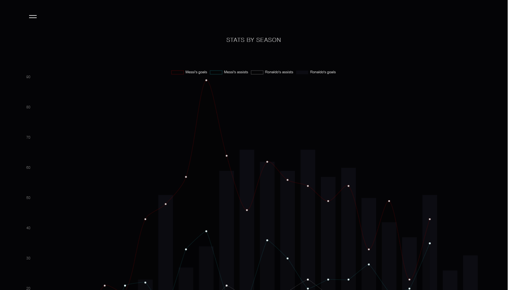

# FOOTBALL PLAYER CHARTS
Football Player Charts is an API about football statistics where you can find information, statistics, and charts demonstrating the player's impact on each team they played for.

## HOW THE DATA IS COLLECTED?

The data is gathered solely through web scraping on  This API is designed for consumption purposes only, and **it only allows for the use of HTTP GET method.**

## ENDPOINTS

The following endpoints are provided:  

- General Stats
- Rate of Goals and Assists per match
- Goals and Assists by Season 
- Performance by Competitions
- Goal Involvements 
- Comparison of Goals, Assists, Performance by Competitions, and Goal Involvement Between Two Players.  

# 💻 Languages, Frameworks, Libraries:

   
   

**View Project: football-player-charts.onrender.com/** 

## Project Images: 

  